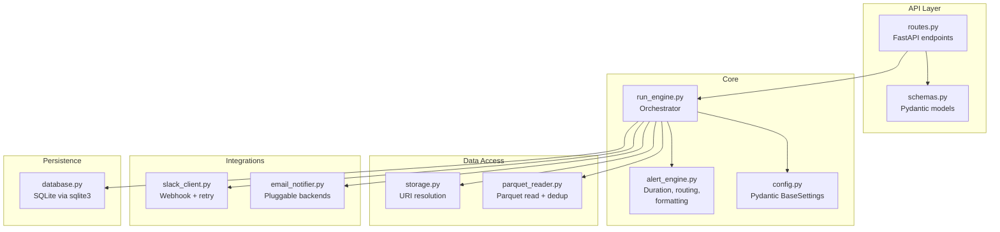
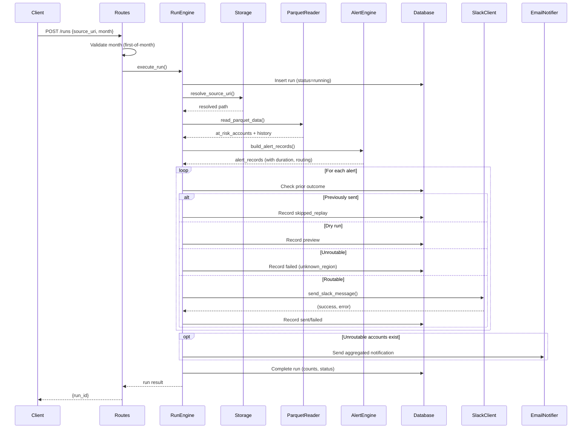
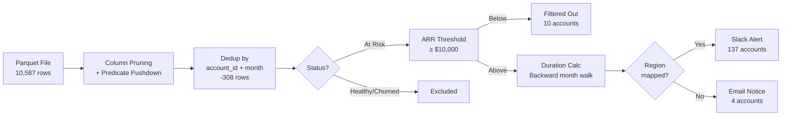

# Architecture

## Component Diagram

```mermaid
graph TB
    subgraph "API Layer"
        routes[routes.py<br/>FastAPI endpoints]
        schemas[schemas.py<br/>Pydantic models]
    end

    subgraph "Core"
        run_engine[run_engine.py<br/>Orchestrator]
        alert_engine[alert_engine.py<br/>Duration, routing,<br/>formatting]
        config[config.py<br/>Pydantic BaseSettings]
    end

    subgraph "Data Access"
        storage[storage.py<br/>URI resolution]
        parquet[parquet_reader.py<br/>Parquet read + dedup]
    end

    subgraph "Integrations"
        slack[slack_client.py<br/>Webhook + retry]
        email[email_notifier.py<br/>Pluggable backends]
    end

    subgraph "Persistence"
        database[database.py<br/>SQLite via sqlite3]
    end

    routes --> run_engine
    routes --> schemas
    run_engine --> config
    run_engine --> storage
    run_engine --> parquet
    run_engine --> alert_engine
    run_engine --> slack
    run_engine --> email
    run_engine --> database
```

## Sequence Diagram — POST /runs

```mermaid
sequenceDiagram
    participant C as Client
    participant R as Routes
    participant E as RunEngine
    participant S as Storage
    participant P as ParquetReader
    participant A as AlertEngine
    participant DB as Database
    participant SL as SlackClient
    participant EM as EmailNotifier

    C->>R: POST /runs {source_uri, month}
    R->>R: Validate month (first-of-month)
    R->>E: execute_run()
    E->>DB: Insert run (status=running)
    E->>S: resolve_source_uri()
    S-->>E: resolved path
    E->>P: read_parquet_data()
    P-->>E: at_risk_accounts + history
    E->>A: build_alert_records()
    A-->>E: alert_records (with duration, routing)

    loop For each alert
        E->>DB: Check prior outcome
        alt Previously sent
            E->>DB: Record skipped_replay
        else Dry run
            E->>DB: Record preview
        else Unroutable
            E->>DB: Record failed (unknown_region)
        else Routable
            E->>SL: send_slack_message()
            SL-->>E: (success, error)
            E->>DB: Record sent/failed
        end
    end

    opt Unroutable accounts exist
        E->>EM: Send aggregated notification
    end

    E->>DB: Complete run (counts, status)
    E-->>R: run result
    R-->>C: {run_id}
```

## Data Flow

```mermaid
flowchart LR
    PQ[Parquet File<br/>10,587 rows] --> FILTER[Column Pruning<br/>+ Predicate Pushdown]
    FILTER --> DEDUP[Dedup by<br/>account_id + month<br/>-308 rows]
    DEDUP --> SPLIT{Status?}
    SPLIT -->|At Risk| THRESHOLD[ARR Threshold<br/>≥ $10,000]
    SPLIT -->|Healthy/Churned| SKIP[Excluded]
    THRESHOLD -->|Below| FILTERED[Filtered Out<br/>10 accounts]
    THRESHOLD -->|Above| DURATION[Duration Calc<br/>Backward month walk]
    DURATION --> ROUTE{Region<br/>mapped?}
    ROUTE -->|Yes| SLACK[Slack Alert<br/>137 accounts]
    ROUTE -->|No| EMAIL[Email Notice<br/>4 accounts]
```
